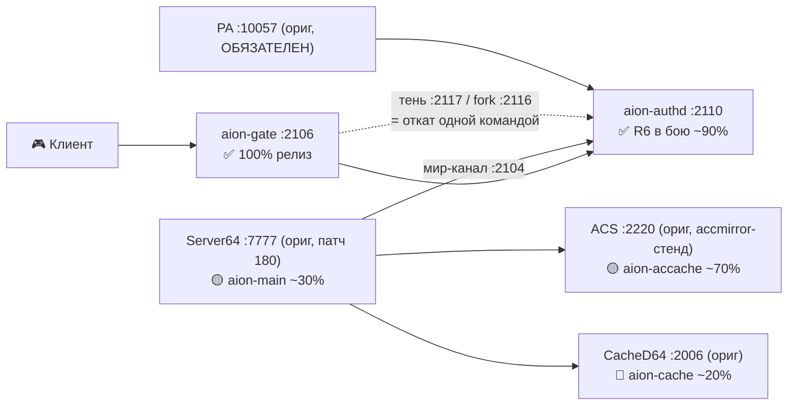
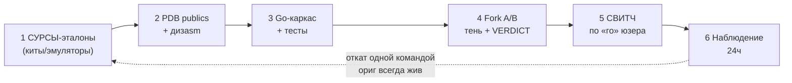

# 🚀 NEXTGEN — перепись стека AION 7.7 EUR на Go (Трек B) + оператор (Трек A)

> **Дата актуализации: 10.10.2026.** Источник истины = этот репо + память `STELGEN/projects/aion_server_2026-10-02` (читать в начале каждого чата).
> **Процесс работы агентов:** [WORKFLOW.md](WORKFLOW.md) — юзер пишет `WORKFLOW: <имя приложения стека>` → агент сам находит компонент, восстанавливает контекст, продолжает с последней фазы, двигает роадмап и актуализирует доки.
> Постановка целиком: [PLAN.md](PLAN.md) · живой план: [ROADMAP.md](ROADMAP.md) · стандарты: [TELEMETRY-SPEC.md](TELEMETRY-SPEC.md), [LOGGING-SPEC.md](LOGGING-SPEC.md), [FORK-SPEC.md](FORK-SPEC.md), [README-TEMPLATE.md](README-TEMPLATE.md), [CREDS.md](CREDS.md), [AGENT-SPEC.md](AGENT-SPEC.md).

## 1. Цель (манифест юзера)

**Переписать ВЕСЬ стек AION 7.7 EUR на Go** — мы владеем сервером до последнего байта, без «чёрных ящиков» NCsoft, без ODBC/DSN/ACP-ритуалов. Принципы:

- **MVP-first**: каждый элемент стека сначала минимально-рабочий (логин и мир живы на каждом шаге); хардинг/допил — после. Никаких «идеальных» переписей до прод-свитча.
- **Форк-атака (FORK-SPEC)**: наше приложение ВСЕГДА ставится сначала тенью/форком — мимикрирует, слушает копию трафика, а оригинал продолжает реально работать. Байт-в-байт паритет → свитч → откат одной командой.
- **Канал VM = Agent API (S12)**: агент работает с VM из песочницы через `http://192.168.0.125:10200/api/agent/*` (run/file/ls/log, токен) — БЕЗ ssh-консоли и PS-кавычек; новый шаг на VM = скрипт через `aionput` + `aionrun "powershell -File"`. SSH (алиас `aion`) = только деплой самого op. Спека: [AGENT-SPEC.md](AGENT-SPEC.md).
- **Управление ТОЛЬКО через `op`** (aion-op): старт/стоп/рестарт/статус — через op-API (`POST /api/action` по Agent API; helpers `C:\Temp\op-act.ps1`/`op-status.ps1` = фолбэк для человека). PowerShell/schtasks напрямую = ТОЛЬКО если op не помог (и потом чиним op). `Start-Process` из ssh-сессии = запрещён (умирает с сессией).
- **Логи raw-first (LOGGING-SPEC)**: каждый бинарь при любой ошибке/падении пишет ВСЁ, что может, raw данные на проводе логируются ПЕРВЫМ ходом, потом логика — чтобы всегда было видно, на чём упало.
- **Сейчас Windows, потом Linux**: оригинальные бинари виндовые → мир живёт на Windows VM. Наши бинари — один Go-исходник, сейчас деплоим exe на Windows, позже собираем Linux-бинари (zram/KSM на Proxmox-хосте).
- **Прод всегда жив**: замены переключаемые, «го» юзера на любой прод-действие.

**Джекпот проекта:** родные PDB-символы NC ко всем ключевым нативным бинарям (~1.1 ГБ на VM, скачаны локально малые; манифесты: [manifest-pdb-big.md](manifest-pdb-big.md), [manifest-bin.md](manifest-bin.md)). Метод переписи отработан **4 раза** (logd → captcha → gate → accache-каркас): capture/mirror → PDB publics (`tools/analysis/pdbpub.py`) → дизasm (`objdump` + .map) → Go каркас → fork A/B → свитч с откатом.

## 2. СТАТУС СТЕКА (главная таблица — 10.10.2026)

| Элемент | Порт | NC-оригинал | Наш nextgen | Статус / % | Деплой / откат | Доки |
|---|---|---|---|---|---|---|
| **Гейт** (точка входа клиентов) | 2106 | `AuthGateD.exe` | [aion-gate/](aion-gate/) | ✅ **100% релиз** (b363dda, exe `f146a415`) на проде с 10.10 (f8912a9/`7c4dcab` с 06.10); полный живой флоу юзера; R6: ходит в НАШ authd 2110; авт-хвосты закрыты live 10.10 (T2-б/в R6, T3, T4, T5); остался опц. T2-а; ⚠ мир-хвост 2-го клиента → aion-main | `D:\SAION\aion-gate\`, задача AionGate; откат: `mode: fork` → ориг 2109, exe `.bak-*` | [README](aion-gate/README.md), [архитектура](aion-gate/docs/architecture-aion-gate-20261007.md) |
| **Логгер** | 2051 | `LogServer64.exe` | [aion-logd/](aion-logd/) | ✅ **~95% в бою** 05.10 (Л1–Л4 закрыты); pending: REF58-процы + ship-приёмник | `D:\SAION\aion-logd\`, задача AionLogCap; откат: `schtasks /run AionLog` | [README](aion-logd/README.md), [snapshot](aion-logd/SNAPSHOT.md) |
| **Капча** | 22206 | `CAPTCHAImageServer.exe` | [aion-captcha/](aion-captcha/) | ✅ **~95% в бою** 05.10 (буфер 10000 за ~4с vs 6.4 мин ориг); pending: ship-приёмник | `D:\SAION\aion-captcha\`, задача AionCAPTCHA → run.cmd; откат: retarget задачи | [README](aion-captcha/README.md), [snapshot](aion-captcha/SNAPSHOT.md) |
| **Authd** (авторизация) | 2104/2110 | `L2Authd.exe` | [aion-authd/](aion-authd/) | ✅ **R6 В БОЮ ~90% (09.10)**: наш authd = живой путь (2110 гейт + 2104 мир, Server64 переключился); полный цикл юзера подтверждён (логин→мир→выход→мгновенный перелогин, pk1=эхо, квитанции 40/3-выход); mssql-стор на реальных ap_* procs | prod :2110+:2104 (AionAuthdProd), тень :2117 (AionAuthdShadow), fork :2116 — `D:\SAION\aion-authd\`; наблюдение 24ч | [README](aion-authd/README.md), [ROADMAP](aion-authd/ROADMAP.md), [RESEARCH](aion-authd/RESEARCH.md) |
| **Кэш аккаунтов (ACS)** | 2220 | `AccountCacheServer.exe` | [aion-accache/](aion-accache/) | 🟡 **~70%**: R0/R0.5/R2 ✅; **R1 capture ✅ + R2.5 wire-канон/раскладки ✅ 10.10** (accmirror v1.1 на стенде :2220→:2221, len=total — офф-бай-2 в v1.0/proto исправлен, маркеры EB/EC, internal/payload на живых golden-кадрах, тесты зелёные); **R3 SQLStore = следующий чат** | НЕ свитчен (ориг жив, стенд зеркалит); prod-ACS :2220 | [README](aion-accache/README.md), [ROADMAP](aion-accache/ROADMAP.md), [RESEARCH](aion-accache/RESEARCH.md) |
| **Кэш мира (CacheD64)** | 2006/2007/2009 | `CacheD64.exe` (22.5МБ) | [aion-cache/](aion-cache/) | 🔬 **~20%**: R0 ✅ 08.10 (PDB 106МБ, словари RQ382/RP255/GQ55/GP53, 781 procs); **R1-prep ✅ 10.10 — опкод-нумерация ВСЕХ 8 протоколов снята из .profile (RP238/RQ381/LP/IC/NPRelay), дифф 5.8⊂7.7 append-only, топ-нагрузка**; осталось R1 wire из log/*.log (pktmon-2006 = loopback-блокер доказан) + R2 семантика | НЕ тронут (ориг жив); 2–4 нед на MVP | [README](aion-cache/README.md), [RESEARCH](aion-cache/RESEARCH.md), [cached-ref/](cached-ref/README.md) |
| **Interchange** | 2005/2305 | `ICServer.exe` | [aion-ic/](aion-ic/) | 🔬 **ресёрч закрыт ~10% (07.10)**: публичного IC-эмулятора НЕТ (GitHub 0; Java-эмуляторы без IC); протокол-факты из AKllX #26 (`InterSvrType`/`ICServerAddr`, matchmaker = отдельный мини-стек; **IC опционален**); киты 2.7/4.6db/5.8 на VM; R0 = следующий. Опционален: лупер безвреден, можно не включать | ориг работает | [README](aion-ic/README.md), [RESEARCH](aion-ic/RESEARCH.md) |
| **Чат** | 10254 | ChannelChat (.NET) | [aion-chat/](aion-chat/) | ⬜ не начат, низший (exe нет — реконструкция) | не запускать | [README](aion-chat/README.md) |
| **Петиции** | 2107 | Petition (.NET) | [aion-petition/](aion-petition/) | ⬜ не начат, низший (exe нет; БД PetitionDB есть) | не запускать | [README](aion-petition/README.md) |
| **Магазин** | 10100 | ShopAgent (.NET) | [aion-shopagent/](aion-shopagent/) | ⬜ не начат, низший (exe нет; бизнес-вопрос юзеру) | не запускать | [README](aion-shopagent/README.md) |
| **GM-панель** | — | GMServer-семейство | [aion-gm/](aion-gm/) | ⬜ вероятно НЕ нужен (GM = builder в SQL; op+SQL покрывают 90%); старт = вопрос юзеру | — | [README](aion-gm/README.md) |
| **Патчи мира (тактика)** | — | Server64+NPCSvr64 (Ghidra, метод #180) | [aion-binpatch/](aion-binpatch/) | ⬜ тактический трек ПОВЕРХ стратегии переписи (aion-npc/aion-main — деприор): #180 ✅ (уже в бинаре), #108/#111/silence = планы готовы (стенд) | fixes-pending/ | [README](aion-binpatch/README.md) |
| **Оператор** | 10200 | — | [aion-op/](aion-op/) | ✅ **Phase 1 в бою ~70%**: управляет стеком (start/stop/restart/restart_pair), группы fork, kick-задачи, SQL/CCU-вкладки, алерты; Phase 1.5 = не начата; ⏳ R6-конфиг: сервис authdprod + expected-down + kill-коллизия aion-authd.exe (OP-1..OP-6, [docs/tech-debt-stack-20261010.md](../docs/tech-debt-stack-20261010.md)) | `C:\aionop\`, задача AionOp (старт ТОЛЬКО `schtasks /run AionOp`) | [README](aion-op/README.md), [aion-op/ROADMAP.md](aion-op/ROADMAP.md), [DEPLOY](aion-op/DEPLOY.md) |
| **PortalAuth (PA)** | 10057 | `01-PAServer7.7.exe` | [aion-pa/](aion-pa/) | ✅ **ориг ОБЯЗАТЕЛЕН в бою** (SYSTEM_ERROR(20) без него; старт ДО authd); наш эмулятор = адаптация **pae** (единственный публичный, доказанно рабочий) — **НЕ писать с нуля**: 🔬 ресёрч закрыт 08.10, R1 = скачать аттачи/интеграция (деприор) | op-кнопка `pa`; откат = ориг exe | [README](aion-pa/README.md), [RESEARCH](aion-pa/docs/pa-binaries-research-20261007.md) |
| **NCoin-релей** | — | `NPRelay64.exe` | [aion-relay/](aion-relay/) | ⬜ **ДЕПРИОРИТ** (исходящий релей, ничего не биндит, логин не блокирует; связка с shopagent); ориг задача DISABLE | не запускать | [README](aion-relay/README.md) |
| **Веб-рейтинг** | — | `RankingServer.exe` (.NET) | [aion-ranking/](aion-ranking/) | ⬜ **ДЕПРИОРИТ** (config.xml в ките нет — реконструкция; данные = aion_ranking_* уже в ACS-схеме) | ориг наличие проверить R0 | [README](aion-ranking/README.md) |
| **NPC-сервер (мир-симуляция)** | 2002/:2006/:2051 | `NPCSvr64.exe` (+ScriptDLL64) | [aion-npc/](aion-npc/) | 🔬 **ДЕПРИОРИТ ~15%** (R0 ✅ / R1 ⏸); **R0 ✅ / R1 ⏸ (юзером до прогресса соседей)** / R2 next; эталоны ×7 клонов (7 эталонов AI-модели 2.7–7.8 — [RESEARCH](aion-npc/RESEARCH.md)); ориг в бою (10–15 мин загрузка, утечка → ночной рестарт пары) | пара NPC+MAIN через op restart_pair | [README](aion-npc/README.md) |
| **Игровое ядро (Main)** | 7777/2002 | `Server64.exe`/MainServer | [aion-main/](aion-main/) | 🟡 **каркас+реестр ~30%: R0–R4 ✅** (08.10: реестр 637 пакетов live, крипта 7.x подтверждена live, Go-каркас тени :7778 с мир-раскладками и tap-режимом; E2E PASS); свитч = гейт после полного MVP-мира (R3.8–R4.4: cached-RPC после aion-cache R1, NPC-пара после aion-npc MVP) | пара через op | [README](aion-main/README.md) |
| **Fork-proxy (инструмент)** | любой | — | [fork-proxy/](fork-proxy/README.md) | ✅ живой: первый форк гейта 2106→2109; эволюция = forkauthd в aion-authd | по схеме FORK-SPEC | [README](fork-proxy/README.md) |
| **.NET-мелочь** | 10100/10254/2107 | ShopAgent/ChannelChat/Petition | exe НЕТ в ките | ⬜ некритично: луперы event-driven, безвредны; Ghidra-silence одним проходом | не запускать | [loops-фикс](../fixes-pending/loops-shopagent-channelchat-petition/) |
| **NPRelay / Ranking** | — | `NPRelay64.exe` / `RankingServer.exe` | — | ⬜ скип (не биндят портов / config.xml в ките нет) | задачи DISABLE | — |

### 2.5 📈 СВОДНЫЙ ДАШБОРД СТЕКА (агрегат — обновлять при КАЖДОМ статус-сдвиге, [WORKFLOW §1.1](WORKFLOW.md))

| Блок | Компоненты (символ · %) | Прогресс блока | Вердикт |
|---|---|---|---|
| 🔐 **Auth-цепочка** | gate ✅ 100 · authd ✅ 90 | **~95%** | ✅ ЖИВОЙ ПУТЬ — юзер играет |
| 📟 **Обвязка** | logd ✅ 95 · captcha ✅ 95 · op ✅ 70 | **~87%** | ✅ в бою |
| 🗄 **Кэши** | accache 🟡 70 · cache 🔬 20 | **~45%** | 🟡 фронт работ |
| 🌍 **Мир** | ic 🔬 10 · npc 🔬 15 · main 🟡 30 | **~18%** | 🔬 деприор (в плане — «бескомпромиссно») |
| 🧰 **Деприор-хвост** | pa ⬜ 10 · binpatch ⬜ 10 · chat/petition/shop/gm/relay/ranking ⬜ 0 | **~5%** | ⬜ план, не отмена |

**ВЕСЬ ТРЕК B: ≈ 46%** (взвешенно по трудоёмкости; пересчёт после accache R2.5 10.10). Ядро «логин+мир живы» — сделано; фронт = кэши (accache R1 → cache R1) и потом мир (npc/main).
*Методика:* % компонента = закрытые фазы его R0..R6 ROADMAP (честно, не «почти готово»); вес = доля трудоёмкости (cache 20% · main 15% · npc 15% · authd 10% · gate/accache 8% · op/ic/logd ~5% · прочее ≤4%); пересчёт при каждом статус-сдвиге. Цвета: 🟢 просто · 🟡 каркас · 🟠 средне · 🔴 тяжело; статусы: ✅ бой · 🔬 ресёрч · ⬜ не начат · ⏳ ждёт «го».

### 2.6 🗺 ЖИВАЯ ТОПОЛОГИЯ ПРОДА (R6) И МЕТОД-ЦИКЛ





⚠ **Секреты и PA:** PA не переписываем (его логика — релей payStat, у нас портала нет; он просто должен быть ЖИВ до authd). Креды/пароли — только на VM в `D:\SAION\creds\` ([CREDS.md](CREDS.md)), в гит/память/логи НЕ класть.

## 3. ПРОД-ТОПОЛОГИЯ (fork-стенд — решение юзера 07.10, ОСТАВИТЬ КАК ЕСТЬ)

**Поток (живой путь R6):** `клиент → aion-gate(2106, authPort=2110) → наш aion-authd(:2110; Server64 → наш :2104)`; копия фреймов → shadow(:2117); откат = `authd-rollback.cmd` + `rollback-gate.ps1`. Граф — [§2.6](#26-живая-топология-прода-r6-и-метод-цикл).

- fork НЕВИДИМ для юзера: живой путь = оригинал; shadow отвечает только в лог `D:\SAION\aion-authd\fork-authd.log` (`C>/O>/N>` + VERDICT=SAME/DIFF).
- Старт-порядок стека: SQL → ACS 2220 → logd 2051 → IC 2005 → CAPTCHA 22206 → **PA 10057** → **наш aion-authd 2104/2110 (задача AionAuthdProd; ориг L2Authd = откат, задача AionAuthOnly)** → gate 2106 → тень 2117 → CacheD 2006 → NPCSvr → Server64 7777 → критерий мира = 8 коннектов на :2002.
- Канон старт-карты: `C:\Temp\start-all.bat` (v6) — НЕ трогать руками; управляем через op.

## 4. СТАНДАРТЫ — ОБЯЗАТЕЛЬНЫЕ УСЛОВИЯ ДЛЯ КАЖДОГО ПОДПРОЕКТА

| # | Стандарт | Суть | Док |
|---|---|---|---|
| S1 | **README-шаблон** | Каждый подпроект ведёт README строго по шаблону: статус/фазы → канон протокола → артефакты → сурсы-эталоны → деплой/откат → логи → блокеры → следующий шаг. Агент, открывший страницу, обязан продолжать её обновлять | [README-TEMPLATE.md](README-TEMPLATE.md) |
| S2 | **Телеметрия** | ship (syslog RFC5424 / HTTP ndjson → rsyslog→Loki→Grafana), НЕ файлами; ship ≠ критичный путь; self-статус; raw+ошибки наружу | [TELEMETRY-SPEC.md](TELEMETRY-SPEC.md) |
| S3 | **Логирование raw-first** | Сначала логируем raw (hex dump до парсинга), потом логика; при падении писать ВСЁ; raw-дамп в `logs\io` + ship-события; откат всегда возможен | [LOGGING-SPEC.md](LOGGING-SPEC.md) |
| S4 | **Fork A/B** | Наше = тень на соседнем порте (мимикрия), ориг = живой путь; VERDICT=SAME/DIFF в логе; паритет байт-в-байт → свитч; откат одной командой | [FORK-SPEC.md](FORK-SPEC.md) |
| S5 | **op-first** | Старт/стоп/рестарт ТОЛЬКО через op-API (helpers `C:\Temp\op-act.ps1 -Action ... -Id ...`); PowerShell напрямую — лишь если op не помог, после чего op чиним; `Start-Process` из ssh запрещён; op сам стартует `schtasks /run AionOp` | [aion-op/README.md](aion-op/README.md) |
| S6 | **Креды** | Единая папка на VM: `D:\SAION\creds\` (ssh, SQL sa, форумы, op). В гит/память/чаты секреты НЕ клать | [CREDS.md](CREDS.md) |
| S7 | **Конфиги** | YAML, комментарии латиницей; правки байтово + LEN-check после; канарейка-баннер в логе старта (`rsa_exponent=65537` = конфиг прочитан); bool-дефолты — кодом | [gate docs](aion-gate/docs/architecture-aion-gate-20261007.md) |
| S8 | **Деплой/откат** | `D:\SAION\<svc>\` = exe + config.yaml + run.cmd; задача `AionXxx` + kick-задача `AionKickXxx` (`/IM <exe>` точно!); exe в гит НЕ попадает — версия = коммит; откат = старый exe `.bak-<commit>`/ретаргет задачи | [ROADMAP §4](ROADMAP.md) |
| S9 | **Тесты** | `go vet ./... && go test ./...` зелёные ДО пуша; golden-фреймы по capture; silence-тесты перепрогоном; фейк-клиенты/эталоны в `cmd/probe`, `cmd/forkprobe` | per-проект README |
| S10 | **Роадмап + промпт** | На каждый компонент: ROADMAP (фазы R0..R6 + журнал теорий) + PROMPT.md (копипаст нового чата); закрытые помечать ⚠ АРХИВ; новые компоненты — self-contained (всё в папке) | [README-TEMPLATE.md](README-TEMPLATE.md) |
| S11 | **WORKFLOW (процесс)** | Запуск чата `WORKFLOW: <имя>`; пульс каждого сообщения; теорий-журнал; «исправил = удалил» из всех доков сразу; самоорганизация под цель | [WORKFLOW.md](WORKFLOW.md) |
| S12 | **Agent API (канал VM)** | Взаимодействие с VM — HTTP/JSON `:10200/api/agent/*` (run/file/ls/log, токен `X-Agent-Token`, обёртка `agent-cli.sh`), НЕ ssh-консоль: без кавычек/кодировок, параллельно. Firewall = Any (NAT-защита, токен — единственный рубеж); audit = `C:\aionop\op.log`. Новый шаг на VM = ps1 через `aionput`+`aionrun`. SSH = только деплой op | [AGENT-SPEC.md](AGENT-SPEC.md) |

## 5. ГДЕ ЧТО ЛЕЖИТ (карта артефактов)

| Что | Гит (этот репо) | VM 192.168.0.125 | Локально (песочница) |
|---|---|---|---|
| **Код переписей** | `nextgen/<svc>/` (Go, тесты, testdata) | `D:\SAION\<svc>\` (+ `<svc>-dev\` полный dev-набор) | — |
| **Ресёрч-доки** | `nextgen/*-RESEARCH.md`, `nextgen/*-ROADMAP.md`, `docs/*.md` | — | — |
| **Референс-сурсы** | [authd-ref/](authd-ref/README.md) (C1 декомпилы, схема БД), [cached-ref/](cached-ref/README.md) (L2 CacheD C1, RPC-карты), [accountcache-ref/](accountcache-ref/README.md) (dispatch, procs) | — | эталоны (7 шт, ~3.9ГБ): `STELGEN/projects/aion_server_2026-10-02/reference/` — aion-germany 7.8 EU (+5.8), Mobius 7.7, **encom-leak-7577 (утёкшие сурсы Encom + Packet Samurai, словарь Game_7.5.x = 938 пакетов)**, AionLightning 7.8.0, aion-encombase-58, beyond-aion 4.8, Yoress ARP (Aion-Core 4.7.5); PDB Server64 publics=74164; см. [aion-main/RESEARCH.md](aion-main/RESEARCH.md) |
| **PDB/бинари NC** | только манифесты MD5 | `D:\AION_LIVE_SERVER\<компонент>\` (гиганты: Server64 284МБ, CacheD64 106МБ, ACS 92МБ) | `~/STELGEN/projects/aion_rev_2026-10-05/artifacts/` (pdb-big/pdb-small) |
| **Capture-дампы** | нет (gitignore) | `C:\Temp\capcap\`, `C:\logd-capture\` | `~/STELGEN/tmp/` (logd-io, aion-vm, captcha-capture) |
| **Креды** | ❌ НИ-НИ (политика) | ✅ `D:\SAION\creds\` — ЕДИНСТВЕННОЕ место | ssh-ключ `~/.ssh/id_ed25519` (dimini-agent), RZ-сессия `/tmp/rz.txt` |
| **Prompts (копипаст чатов)** | `nextgen/PROMPT-*.md` (открытые: ACCACHE, AUTHD, CACHED, ICSERVER; ⚠ АРХИВ: CAPTCHA, AUTHGATE*) | — | — |

## 6. ДАЛЬНЕЙШИЙ ПОРЯДОК (сводка; детали = [ROADMAP.md](ROADMAP.md))

1. **aion-accache R3** — SQLStore (go-mssqldb) + полный хендлер-набор по телам procs; хвосты R2.5: поля Fatigue/Trial, push-семантика 13/15/20/21, T2-канал. Capture+wire-канон ✅ 10.10 (R2.5); дозахват недостающих cmds = просто логин юзера (accmirror-стенд жив). Промпт: [aion-accache/PROMPT.md](aion-accache/PROMPT.md).
2. **aion-cache (CacheD64) R1** — wire 2006 из готовых log/*.log (356МБ) + capture через fork-копию :2016 (go) / тест-мир LAN — pktmon-2006 = loopback-блокер доказан → R2 дизasm → R3 Go MVP (read-путь + write-транзит). Папка-заготовка: [aion-cache/](aion-cache/README.md) (промпт внутри).
3. **aion-authd R6-хвосты** — завершить наблюдение 24ч; pk1-эхо/IP-дворд A/B на живых логинах (мир уже на нашем 2104); опц. ACS-клиент 2220 (T3).
4. **aion-gate** — авт-хвосты закрыты live 10.10 (T3 ✅, T4 ✅ 2 параллельны чисто, T5 ✅ exe f146a415 на проде); T6 ✅ (тег gate-7.7-final на b363dda); остался опц. T2-а. ⚠ Мир-хвост (не гейт): 2-й параллельный клиент виснет на GS-входе → кросс-пульс aion-main.
5. **op Phase 1.5** — событийный watchdog (ночной рестарт пары = тумблер), async-ожидания маркеров.
6. **Телеметрия** — rsyslog→Loki→Grafana на LAN + `ship.enabled: true` в прод-конфигах logd/captcha.
7. **REF58-процы** — деплой `scripts/sql/ref58-logprocs-pending-20261005.sql` + маппинг metric1-4 → logdb.
8. **Ghidra-патчи** — матчмейкер (#108), манастоны (#111) в копии #180-бинаря.
9. **ICServer / ChannelChat / Petition / ShopAgent / GM / binpatch** — низший приоритет; папки-заготовки созданы (README+ROADMAP+PROMPT в каждой), старт по команде `WORKFLOW: <имя>` ([WORKFLOW.md](WORKFLOW.md)).

## 7. СТРУКТУРА ДИРЕКТОРИИ

```
nextgen/
├── README.md            ← ЭТОТ хаб (стек-таблица + стандарты)
├── PLAN.md              ← постановка цели/принципов
├── WORKFLOW.md          ← ПРОЦЕСС работы агентов (запуск «WORKFLOW: <имя>», пульс, теорий-журнал)
├── ROADMAP.md           ← живой план (обновлять В КАЖДОМ чате)
├── TELEMETRY-SPEC.md    ← S2 телеметрия
├── LOGGING-SPEC.md      ← S3 raw-first логирование
├── FORK-SPEC.md         ← S4 fork A/B методология
├── README-TEMPLATE.md   ← S1 шаблон README подпроекта
├── CREDS.md             ← S6 политика кредов (значения — только на VM)
├── AGENT-SPEC.md        ← S12 Agent API — канал VM для агентов (run/file/ls/log)
├── agent-cli.sh         ← обёртка Agent API (aionrun/aionput/aionlog/...) — source of truth
├── aion-op/             ← оператор (Трек A) ✅ прод (README+ROADMAP+DEPLOY+docs/)
├── aion-logd/           ← замена LogServer64 ✅ прод (README+RESEARCH+SNAPSHOT+docs/)
├── aion-captcha/        ← замена CAPTCHAImageServer ✅ прод (README+SNAPSHOT+PROMPT-ARCHIVE+docs/)
├── aion-gate/           ← замена AuthGateD ✅ релиз (README+cmd/+deploy/+docs/ = архитектура+архивы PROMPT)
├── aion-authd/          ← замена L2Authd ✅ R6 (README+RESEARCH+ROADMAP+PROMPT+docs/)
├── aion-accache/        ← замена AccountCacheServer 🟡 (README+RESEARCH+ROADMAP+PROMPT)
├── aion-cache/          ← ЗАГОТОВКА CacheD64 🔬 (README+RESEARCH+ROADMAP+PROMPT)
├── aion-ic/             ← ICServer 🔬 (ресёрч закрыт → R0; опционален по AKllX)
├── aion-npc/            ← ЗАГОТОВКА NPCSvr64 ⬜ ДЕПРИОРИТ (мир-симуляция; тактика = aion-binpatch)
├── aion-main/           ← ЗАГОТОВКА Server64/MainServer ⬜ ДЕПРИОРИТ (ядро; последний)
├── aion-pa/             ← ЗАГОТОВКА PortalAuth ⬜ ДЕПРИОРИТ (ориг обязателен; наш = адаптация pae)
├── aion-relay/          ← ЗАГОТОВКА NPRelay64 ⬜ ДЕПРИОРИТ (NCoin-релей)
├── aion-ranking/        ← ЗАГОТОВКА RankingServer ⬜ ДЕПРИОРИТ (веб-рейтинг)
├── aion-chat/           ← ЗАГОТОВКА ChannelChat ⬜ низший (README+ROADMAP+PROMPT)
├── aion-petition/       ← ЗАГОТОВКА Petition ⬜ низший (README+ROADMAP+PROMPT)
├── aion-shopagent/      ← ЗАГОТОВКА ShopAgent ⬜ низший (README+ROADMAP+PROMPT)
├── aion-gm/             ← ЗАГОТОВКА GM-панель ⬜ (README+ROADMAP+PROMPT+docs/ выдачи)
├── aion-binpatch/       ← ЗАГОТОВКА Ghidra-патчи мира ⬜ (README+ROADMAP+PROMPT+docs/)
├── fork-proxy/          ← fork-инструмент (README)
├── authd-ref/           ← референс-сурсы authd (README-индекс + C1 декомпилы, схема БД)
├── cached-ref/          ← референс-сурсы CacheD64 (README-индекс + L2 CacheD C1, RPC-карты)
├── accountcache-ref/    ← референс-сурсы ACS (README-индекс + dispatch, procs, конфиги)
└── manifest-*.md        ← MD5-манифесты PDB/бинарей (сами бинари в гит НЕ кладём)

СИММЕТРИЯ-КОНТРАКТ: у каждого компонента = своя папка, внутри self-contained:
README.md + ROADMAP.md (или SNAPSHOT.md/архитектура-док) + PROMPT.md (+ RESEARCH.md где есть,
+ docs/ для истории сессий/ресёрчей). В корне nextgen — ТОЛЬКО сквозные спеки/планы/манифесты.
Архивные промпты лежат рядом с кодом своего компонента (docs/PROMPT-*.md / PROMPT-ARCHIVE.md).
```

## 8. ГИГИЕНА ДЛЯ АГЕНТОВ (как продолжать проект)

1. Открыл чат → прочитай `nextgen/README.md` + `nextgen/ROADMAP.md` + память `STELGEN/projects/aion_server_2026-10-02`.
2. Работаешь по последнему пункту §6 соответствующего компонента (или по его `PROMPT-*.md`).
3. Каждый значимый шаг = коммит + пуш + обновление: README компонента (статус/фаза/артефакты), ROADMAP.md, память.
4. Сталкиваешься со «старым» фактом, противоречащим живым данным → исправляешь на месте, помечаешь в леджере/доке, не оставляешь ложь в доках.
5. Статусы честные: ✅ в бою / 🟡 каркас / 🔬 ресёрч / ⬜ не тронут; проценты по фазам роадмапа.
6. **Канал VM = Agent API (S12)**: `source nextgen/agent-cli.sh` → `aionrun`/`aionput`/`aionlog`; инлайн-PS через ssh НЕ использовать никогда (кавычки/кодировки = источник ошибок); ssh — только деплой самого op.
